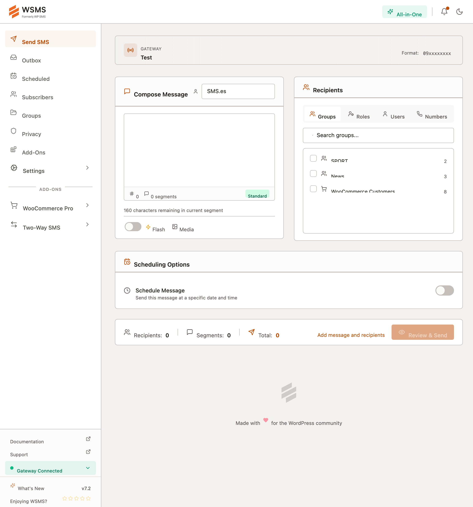

<p align="center">
  
</p>

<p align="center">
  <a href="https://wordpress.org/plugins/wp-sms/"></a>
  <a href="https://wordpress.org/plugins/wp-sms/"></a>
  <a href="https://plugintests.com/plugins/wporg/wp-sms/latest"></a>
  <a href="https://plugintests.com/plugins/wporg/wp-sms/latest"></a>
</p>

# WSMS - WordPress SMS Plugin

SMS & MMS Notifications, 2FA, OTP, and Integrations with E-Commerce and Form Builders. Send messages through **200+ gateways** including Twilio, Plivo, Clickatell, BulkSMS, Infobip, Vonage (Nexmo), Messagebird, ClickSend and more. [See all gateways](https://wsms.io/gateways/)

<p align="center">
  
</p>

## Send SMS via PHP

```php
$to = ['01000000000'];
$msg = "Hello World!";

wp_sms_send($to, $msg);
```

## Send MMS

```php
$mediaUrls = ['https://yoursite.com/image.png'];

wp_sms_send($to, $msg, false, false, $mediaUrls);
```

## Features

- 200+ SMS gateway integrations ([full list](https://github.com/veronalabs/wp-sms/tree/master/includes/gateways))
- Send SMS/MMS to phone numbers, subscribers, and WordPress users
- SMS newsletter subscription with activation codes
- Notification SMS for new posts, WordPress updates, new users, comments, and logins
- WooCommerce, Contact Form 7, and Easy Digital Downloads integrations
- Newsletter subscriber widget
- WordPress Hooks and WP-REST API support
- Subscriber import/export

## Installation

> This is the development (pre-build) version. For the latest stable release, visit the [WordPress Plugin Directory](https://wordpress.org/plugins/wp-sms/).

### Clone and install

```bash
git clone git@github.com:veronalabs/wp-sms.git
cd wp-sms
composer install
```

### Build assets

```bash
pnpm install
pnpm build
```

### Watch for changes

```bash
pnpm dev
```

## Hooks

### Actions

**`wp_sms_send`** - Fires when an SMS is sent.

```php
function send_mail_when_send_sms($message_info) {
    wp_mail('you@mail.com', 'Send SMS', $message_info);
}
add_action('wp_sms_send', 'send_mail_when_send_sms');
```

**`wp_sms_add_subscriber`** - Fires when a new subscriber is added.

```php
function send_sms_when_subscribe_new_user($name, $mobile) {
    $to = [$mobile];
    $msg = "Hi {$name}, Thanks for subscribing.";
    wp_sms_send($to, $msg);
}
add_action('wp_sms_add_subscriber', 'send_sms_when_subscribe_new_user', 10, 2);
```

### Filters

**`wp_sms_from`** - Modify the sender number.

```php
function wp_sms_modify_from($from) {
    return $from . ' 0';
}
add_filter('wp_sms_from', 'wp_sms_modify_from');
```

**`wp_sms_to`** - Modify receiver numbers.

```php
function wp_sms_modify_receiver($numbers) {
    $numbers[] = '09xxxxxxxx';
    return $numbers;
}
add_filter('wp_sms_to', 'wp_sms_modify_receiver');
```

**`wp_sms_msg`** - Modify the message text.

```php
function wp_sms_modify_message($message) {
    return $message . "\nPowered by: WSMS";
}
add_filter('wp_sms_msg', 'wp_sms_modify_message');
```

## Distribution ZIP

```bash
composer dist
```

Creates `dist/wp-sms.zip`, excluding files listed in `.distignore`.

**Prerequisites:** `composer install --no-dev` and `pnpm build` before creating the ZIP.

## Internationalization

WSMS is translated into many languages. See the [translate page](https://translate.wordpress.org/projects/wp-plugins/wp-sms) for details.

## Resources

- [WordPress.org](https://wordpress.org/plugins/wp-sms/)
- [Website](https://wsms.io)
- [Documentation](https://wsms.io/docs)
- [Development Guide](https://github.com/wp-sms/wp-sms/wiki)
